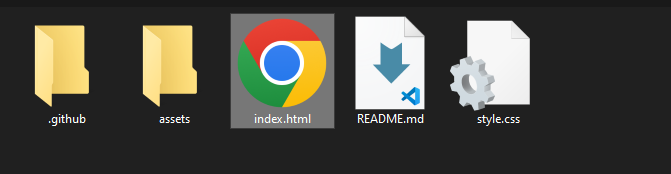

<h1 align="center">🚀 Page Spotify 🚀</h1>


## Requisitos

### Para clonar o projeto você vai precisar do <a href="https://git-scm.com/downloads">git</a>

## 🎲 Iniciando o projeto 

```bash
# Clonando o projeto
git clone https://github.com/rafaelmasselli/FrontEnd-PageSpotify
```

## Abrindo o projeto 

> Entre na pasta do projeto
> Aperte no index.html


> E assim ira abrir o projeto


## Ferramentas usadas no projeto

- [x] HTML
- [x] CSS